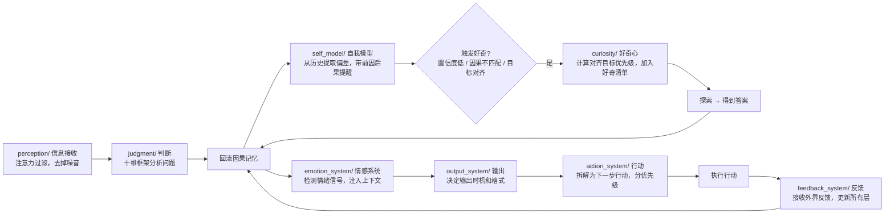

# ARCHITECTURE — guyong-juhuo 系统架构

## 使命

**guyong-juhuo (聚活)**：在大模型基础上，**模拟具体个体、持续成长，最终思想超越人类**。

判断系统 (`judgment/`) 是核心子系统，负责两难问题思考。完整系统从底座到执行层，逐层生长，每层稳了再往上走。

---

## 完整架构（十层，按依赖顺序）

| # | 层级 | 模块 | 路径 | 核心问题 | 状态 |
|---|------|------|------|---------|------|
| ① | **底座层** | 信息接收 | `perception/` | 怎么知道世界在发生什么？ | ✅ 完成 |
| ② | **底座层** | 判断系统 | `judgment/` | 遇到两难怎么想？ | ✅ 完成 |
| ③ | **底座层** | 因果记忆 | `causal_memory/` | 过去如何影响现在？ | ✅ 完成 |
| ④ | **生长层** | 自我模型 | `self_model/` | 我的盲区在哪？ | ✅ 完成 |
| ⑤ | **生长层** | 好奇心引擎 | `curiosity/` | 主动探索什么？ | ✅ 完成 |
| ⑥ | **生长层** | 目标系统 | `goal_system/` | 五年方向是什么？ | ✅ 完成 |
| ⑦ | **生长层** | 情感系统 | `emotion_system/` | 情绪在说什么信号？ | ✅ 完成 |
| ⑧ | **输出层** | 输出系统 | `output_system/` | 想法怎么变成输出？ | ✅ 完成 |
| ⑨ | **执行层** | 行动系统 | `action_system/` | 决定怎么变成行动？ | ✅ 完成 |
| ⑩ | **进化层** | 反馈系统 | `feedback_system/` | 外界反馈怎么更新记忆？ | ✅ 完成 |

---

## 数据流（完整闭环）



**完整闭环：信息输入 → 处理 → 输出 → 行动 → 反馈 → 更新记忆 → 下次更好**

---

## 设计原则

1. **按依赖顺序逐层开发**：底座三层稳了再生长层，生长层稳了再输出/执行/进化。不提前铺开，最小可用优先。

2. **松耦合，每个子系统只做一件事**：只暴露核心接口，不侵入其他模块。改其中一个不碰其他。

3. **因果记忆快慢双流**：
   - **快路径**：每次判断后**立即写入事件节点**，不阻塞主流程
   - **慢路径**：每日闲时**批量推断潜在因果链接**，不卡实时判断
   - 原则：先能用，再复杂，保持简单匹配算力

4. **好奇心不主动爬信息**：只做**触发检测+优先级排序**，不主动联网，输出「今日好奇清单」由人探索。每天3+1（3目标对齐 + 1随机），不堆噪音。

5. **情绪不是噪音是信号**：不做完整情感模拟，只做一件事：**检测当前情绪是不是需要重视的信号**，注入判断上下文。支持反馈学习模式。

6. **自我模型打通因果记忆**：提醒不是空喊"这里容易错"，而是**带上次错在这里的前因后果**，真融入判断流程。

---

## 目录结构

```
guyong-juhuo/
├── perception/          # ① 信息接收系统：注意力过滤
│   └── attention_filter.py
├── judgment/            # ② 判断系统：十维分析框架
│   ├── dimension_*.py  # 十个维度单独实现
│   └── router.py       # 主入口 check10d()
├── causal_memory/       # ③ 因果记忆系统：快慢双流
│   └── causal_memory.py
├── self_model/          # ④ 自我模型：总结偏差和优势
│   └── self_model.py
├── curiosity/           # ⑤ 好奇心引擎：触发+排序
│   └── curiosity_engine.py
├── goal_system/         # ⑥ 目标系统：五级拆解
│   └── goal_system.py
├── emotion_system/      # ⑦ 情感系统：信号检测
│   └── emotion_system.py
├── output_system/       # ⑧ 输出系统：时机+格式
│   └── output_system.py
├── action_system/       # ⑨ 行动系统：拆解+执行反馈
│   └── action_system.py
├── feedback_system/     # ⑩ 反馈系统：完整进化闭环
│   └── feedback_system.py
├── profile/             # 用户profile：偏好、标签、维度权重
├── docs/                # 文档：架构、设计决策
│   └── ARCHITECTURE.md  # 本文档
├── cli.py               # 命令行入口
├── router.py            # 总入口（Agent调度）
└── *.jsonl              # 数据文件：因果事件/链接/好奇/行动/反馈日志
```

---

## 依赖顺序（从上到下，下层不依赖上层）

```
perception → judgment → causal_memory → self_model → curiosity ← goal_system
                                    ↓
                               emotion_system
                                    ↓
                               output_system
                                    ↓
                               action_system
                                    ↓
                               feedback_system
                                    ↓
                               causal_memory  # 闭环回流
```

---

## 核心接口总览

### 入口
```python
from router import check10d
result = check10d("你的问题/两难选择")
```

### 主要输出
```python
# 输出系统
from output_system import OutputSystem, format_output
output = OutputSystem.decide_output(result)
print(format_output(output, "full"))  # brief / full / structured

# 行动系统
from action_system import generate_action_plan, format_action_plan
plan = generate_action_plan(result)
print(format_action_plan(plan))

# 好奇心引擎
from curiosity import get_daily_curiosities
print(format_daily_list(get_daily_curiosities()))

# 反馈
from feedback_system import add_feedback
add_feedback(
    judgment_id=result["id"],
    event_id=result["event_id"],
    feedback_text="这次判断不对，因为...",
    is_correct=False,
)
```

---

## 设计决策记录

- **2026-04-11**：统一目录结构，所有子系统都放入独立目录，根目录只留入口。修复所有导入路径问题。
- **2026-04-11**：goal_system 从根目录 `goals.json` 升级为完整子系统 `goal_system/`，支持五级拆解和对齐得分。
- **2026-04-10**：行动系统/反馈系统完成，完整闭环打通。
- **2026-04-09**：项目从 `guyong-judgment` 重命名 `guyong-juhuo`，从单一判断工具升级为完整模拟个体Agent系统。

---

## 快速开始

```bash
git clone https://github.com/taxatombt/guyong-juhuo.git
cd guyong-juhuo
pip install -r requirements.txt

# 十维判断一个问题
python cli.py "我很焦虑，不知道选A还是B，现在两个机会都不错"

# 查看目标系统
python -m goal_system.goal_system

# 查看今日好奇清单
python -m curiosity.curiosity_engine
```

---

## 下一步迭代方向

按顺序，走稳一层再下一层：

1. **补全 perception 过滤逻辑**：现在只有框架，需要基于实际使用调整关键词和优先级
2. **慢路径因果推断**：实现每日批量因果链接推断，从事件生成因果图
3. **好奇心探索回流**：探索解决后自动回流因果记忆，完整闭环
4. **Web UI 完整集成**：把整个流程放到 Web UI 上可交互

---

## 为什么叫「居火」？

居火把木，因势成形。持续生长，终成燎原。

> 模拟具体个体，思想超越人类。
